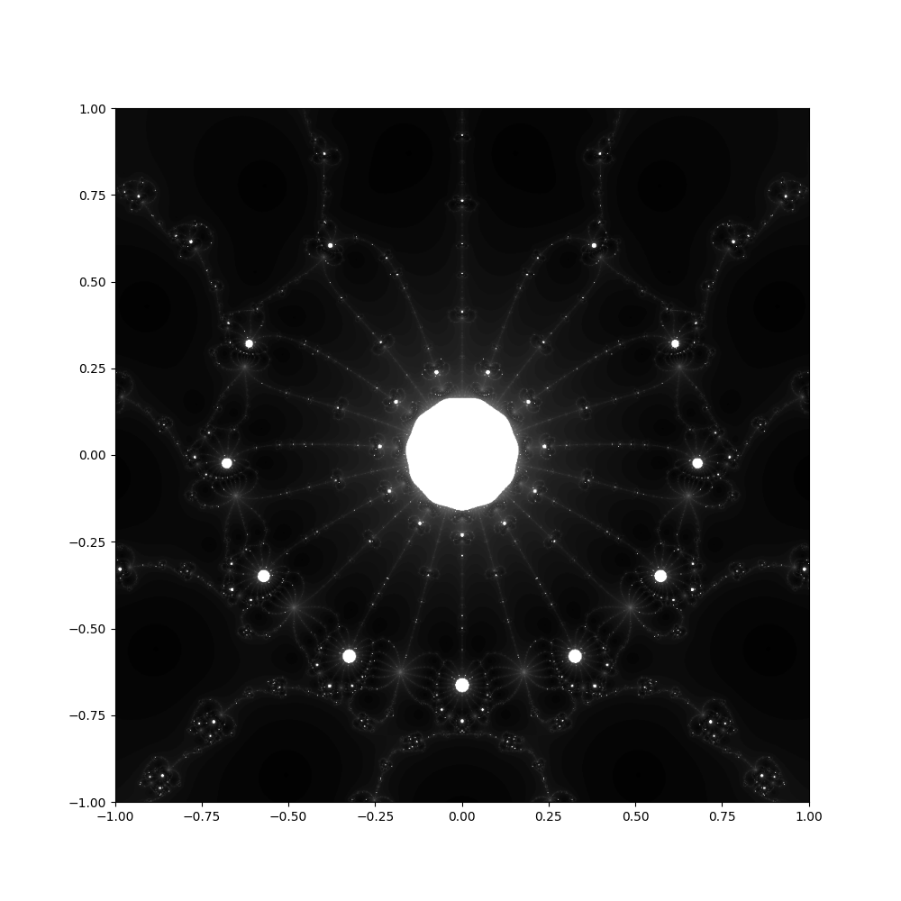

# Complex roots

Python scripts to generate visualizations of iterative root finding algorithms
in the complex plane using [matplotlib](https://matplotlib.org/) and
[numpy](https://numpy.org/).

## Samples





## PDF document generation

Requires installation of [pandoc universal document converter](https://pandoc.org/).

```
pandoc output.md -o output.pdf
```

## About

See [output.pdf](output.pdf) document for more information about the algorithms.